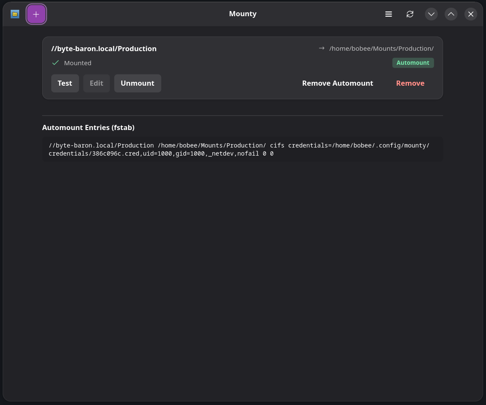

# Mounty

[](https://aur.archlinux.org/packages/mounty)
[](https://aur.archlinux.org/packages/mounty)
[](https://gtk.org)
[](LICENSE)

A GTK4 application for managing SMB/CIFS network shares on Linux.

I made this because I'm too lazy to manually edit fstab every time I need to mount a network share. Plus, as more novice users switch to Linux, this might actually prove useful.



## Features

- Add and manage network shares
- Test connections before saving
- Mount/unmount shares with one click
- Automount via fstab integration
- Secure credential storage

## Installation

### Arch Linux (AUR)
```bash
yay -S mounty
```

### From Source
```bash
# Dependencies
sudo pacman -S python-gobject gtk4 libadwaita smbclient cifs-utils polkit

# Run
python3 mounty.py
```

## License

MIT

---

*I use Arch btw*
