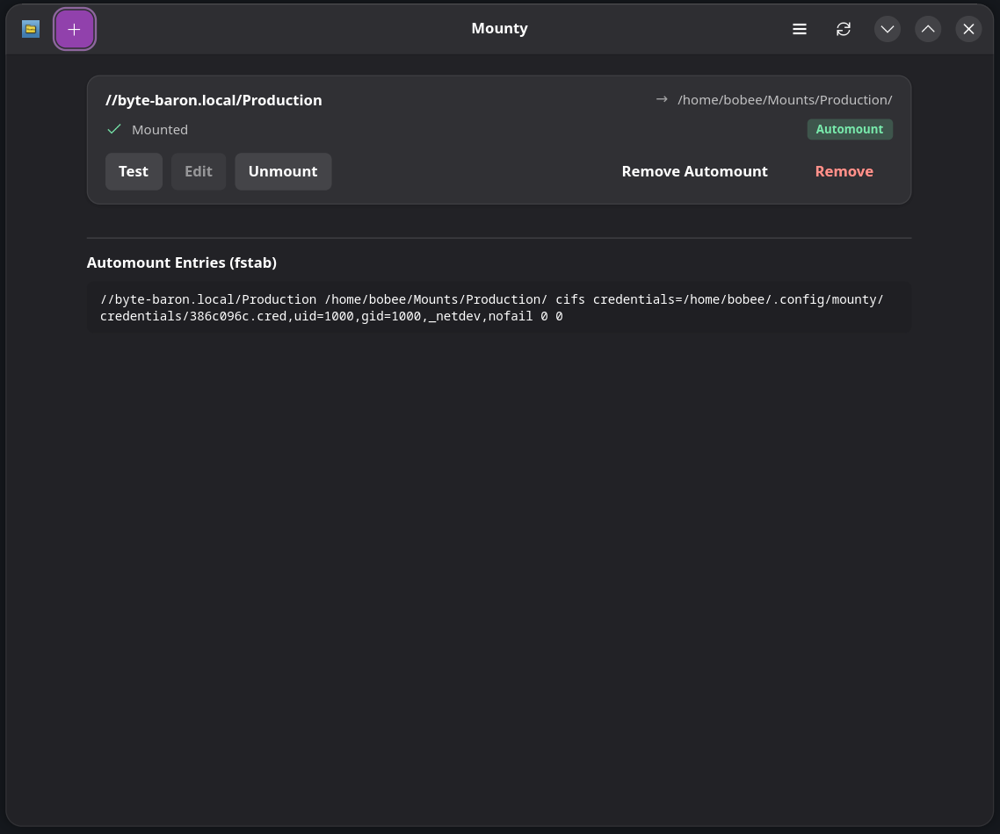

# Mounty

[](https://aur.archlinux.org/packages/mounty)
[](https://aur.archlinux.org/packages/mounty)
[](https://gtk.org)
[](LICENSE)

A GTK4 application for managing SMB/CIFS network shares on Linux.

I made this because I'm too lazy to manually edit fstab every time I need to mount a network share. Plus, as more novice users switch to Linux, it might actually prove useful.



## Features

- Add and manage network shares
- Test connections before saving
- Mount/unmount shares with one click
- Automount via fstab integration
- Secure credential storage

## Installation

### Arch Linux (AUR)
```bash
yay -S mounty
```

### From Source
```bash
# Arch dependencies
sudo pacman -S python-gobject gtk4 libadwaita smbclient cifs-utils polkit
# Mint dependencies
sudo apt install gir1.2-gtk-4.0 gir1.2-adw-1

# Run
python3 mounty.py
```

## Packaging

Right now Mounty is only on the AUR. If you'd like to package it for other distros (Snap Store, PPA, Fedora COPR, etc.), please feel free to do so! I'd really appreciate it. I mostly use CachyOS, so I'm not familiar with other packaging ecosystems and I'd rather have someone experienced take care of it.

## Contributing

Contributions are welcome! I originally built this for myself, so I might have missed a few things. If you run into issues or have ideas for improvements, feel free to open an issue or submit a PR.

## License

MIT

---
